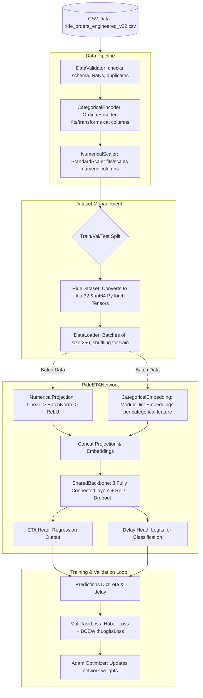

# Ride ETA & Delay Prediction Project Guide

Welcome to the **Ride_ETA** project documentation. This guide is designed to help you understand the project's purpose, folder structure, neural network architecture, and the complete dataflow from raw data to predictions.

---

## 📌 Project Overview

This project is a **Multi-Task Deep Learning system** implemented in PyTorch. Its goal is to solve two key prediction problems for ride orders simultaneously:

1. **ETA Regression**: Predicting the actual total duration of a ride in minutes (`actual_total_time_minutes`).
2. **Delay Classification**: Predicting whether a ride will be delayed (`order_delayed` - 0 for on-time, 1 for delayed).

By training a single model to perform both tasks (Multi-Task Learning), the network learns shared representations that improve the performance of both targets while saving computational resources.

---

## 📂 Project Directory Structure

Here is how the project files are organized:

```
Ride_ETA/
│
├── configs/
│   └── config.py              # Configuration constants, hyper-parameters, and feature column groups
│
├── preprocessing/
│   ├── pipeline.py            # Chaining validator, encoder, and scaler together
│   ├── validator.py           # Validating raw data for anomalies, missing targets, or schema issues
│   ├── encoder.py             # Ordinal encoding of categorical features
│   └── scaler.py              # StandardScaler scaling of numerical features
│
├── datasets/
│   ├── ride_dataset.py        # PyTorch Dataset mapping pandas rows to PyTorch tensors
│   └── dataloader.py          # PyTorch DataLoader wrapper for batching and shuffling
│
├── models/
│   └── ride_eta_network.py    # PyTorch Multi-Task Neural Network definition
│
├── losses/
│   └── losses.py              # Multi-Task Loss combining Huber Loss (ETA) and BCEWithLogitsLoss (Delay)
│
├── metrics/
│   ├── regression_metrics.py  # Calculates MAE, RMSE, and R² for ETA predictions
│   └── classification_metrics.py # Calculates Accuracy, Precision, Recall, F1, and AUC-ROC for delays
│
├── callbacks/
│   ├── checkpoint.py          # Saves the model parameters if validation loss improves
│   └── early_stopping.py      # Halts training if validation loss doesn't improve for N epochs
│
├── trainer/
│   └── trainer.py             # Core training and validation loop manager
│
├── predictor/
│   └── predictor.py           # Inference manager for computing predictions on new datasets
│
├── utils/
│   └── model_metadata.py      # Utilities to save and load network metadata (feature counts/cardinalities)
│
├── data/                      # Data files (CSV format) and offline metadata documentation
│
├── saved_models/              # Directory where checkpoints and metadata JSON are stored
│
├── train.py                   # Main entry point to train the model from scratch
├── evaluate.py                # Main entry point to evaluate a trained model on the test dataset
└── predict.py                 # Main entry point to run inference on a dataset
```

---

## 🔄 End-to-End Dataflow

The diagram below represents how data flows through the project from ingestion to training/inference:



### 1. Training Phase Flow (`train.py`)
1. **Load Data**: The system reads the engineered dataset `ride_orders_engineered_v22.csv` into a pandas DataFrame.
2. **Preprocessing**: 
   - `DataValidator` ensures no required columns are missing, order IDs are unique, and target columns have no missing values.
   - `CategoricalEncoder` uses `sklearn.preprocessing.OrdinalEncoder` to convert categorical text/IDs (like `driver_id`, `pickup_zone`, etc.) to integers (0, 1, 2, ...).
   - `NumericalScaler` scales all continuous and time features using `sklearn.preprocessing.StandardScaler` (z-score normalization).
3. **Data Splitting**: The DataFrame is split sequentially: **70% for Training**, **15% for Validation**, and **15% for Testing**.
4. **PyTorch Dataset & Dataloader creation**:
   - `RideDataset` extracts numerical and categorical variables as NumPy arrays, then returns PyTorch tensors inside a dictionary per item.
   - `create_dataloader` creates batch-fetching iterators.
5. **Model Initialization**: The `RideETANetwork` dynamically calculates embedding dimensions based on the cardinalities of the categorical columns.
6. **Training Loop (`trainer.py`)**:
   - For each epoch, data is passed through the network, the multi-task loss is computed, backpropagation runs, and weights are updated.
   - Predictions are stored to compute regression metrics (MAE, RMSE, R²) and classification metrics (Accuracy, Precision, Recall, F1, AUC-ROC) at the end of each epoch.
   - Preprocessing encoders, scalers, and model checkpoints are saved to the filesystem under `saved_models/` and `data/artifacts/`.

### 2. Evaluation Phase Flow (`evaluate.py`)
1. Model structure is built from the saved `ride_eta_metadata.json` metadata.
2. Saved weights (`ride_eta_model.pth`) are loaded into the network.
3. Preprocessing artifacts (scaler and encoder) are loaded from the disk.
4. The dataset is loaded, transformed using the loaded preprocessing pipeline (without refitting), split, and the test portion is evaluated to report final metrics.

### 3. Prediction Phase Flow (`predict.py`)
1. Model and preprocessing pipelines are loaded from disk.
2. Preprocessing transformations are applied to the input dataset.
3. The dataset is passed to `Predictor` which runs batch inference, applies Sigmoid to the delay logits to produce probabilities, thresholding at `0.5` to output binary delay flags.

---

## 🧠 Neural Network Architecture (`RideETANetwork`)

The model is designed specifically for tabular data containing both numerical features and high-cardinality categorical IDs.

### 1. Numerical Projection (`NumericalProjection`)
Numerical inputs are projected into a dense vector space:
$$\text{Output} = \text{ReLU}(\text{BatchNorm1d}(\text{Linear}(\text{Numerical\_Features})))$$
This projects the various numerical features into a standard representation size (default: 64 features).

### 2. Categorical Embeddings (`CategoricalEmbedding`)
Categorical features (like `driver_id` or `pickup_zone`) can have many unique values. Instead of one-hot encoding them (which creates massive, sparse matrices), the model uses **Embedding Layers** to represent each class as a low-dimensional dense vector.
- **Dynamic Dimension Selection**: The dimension of each embedding is automatically calculated based on its cardinality:
  $$\text{Embedding Dim} = \min(50, \text{round}(1.6 \times \text{cardinality}^{0.56}))$$
- **Handling Unknowns**: Unknown or unseen categories are assigned index `-1`, which shifts to `0` during forward propagation (`categorical_features + 1`) to point to a reserved embedding index for unknowns.

### 3. Shared Backbone (`SharedBackbone`)
The projected numerical features and all categorical embedding vectors are concatenated together.
This combined feature vector is passed through a shared sequence of dense layers:
1. `Linear(in_features, 256)` $\to$ `BatchNorm1d` $\to$ `ReLU` $\to$ `Dropout(0.30)`
2. `Linear(256, 128)` $\to$ `BatchNorm1d` $\to$ `ReLU` $\to$ `Dropout(0.30)`
3. `Linear(128, 64)` $\to$ `BatchNorm1d` $\to$ `ReLU` $\to$ `Dropout(0.30)`

This backbone learns complex, non-linear interactions between the features that are useful for both predicting the ETA and predicting the delay.

### 4. Multi-Task Output Heads (`PredictionHead`)
The output of the shared backbone (64 features) splits into two independent heads:
- **ETA Head**: A two-layer network that outputs a single scalar representing the ETA (in minutes).
- **Delay Head**: A two-layer network that outputs a single scalar representing the delay logit.

---

## 📊 Loss Function Configuration (`MultiTaskLoss`)

Multi-Task learning requires optimizing a joint loss function. The total loss is calculated as:

$$\text{Total Loss} = (w_{\text{eta}} \times \mathcal{L}_{\text{eta}}) + (w_{\text{delay}} \times \mathcal{L}_{\text{delay}})$$

- **ETA Loss ($\mathcal{L}_{\text{eta}}$)**: Uses **Huber Loss** (Smooth L1 Loss). Huber Loss behaves like Mean Absolute Error (MAE) when the error is large, and Mean Squared Error (MSE) when the error is small. This makes the optimization robust to outliers (e.g., extremely long traffic delays).
- **Delay Loss ($\mathcal{L}_{\text{delay}}$)**: Uses **Binary Cross-Entropy with Logits Loss** (`BCEWithLogitsLoss`). It evaluates the delay classification performance directly from raw logits.
- **Weights ($w_{\text{eta}}, w_{\text{delay}}$)**: Configured in `configs/config.py` (default: `1.0` for both).

---

## ⚙️ How to Run the Project

### Prerequisites
Make sure you have all requirements installed. Check the `requirements.txt` file in the project.

### 1. Training the Model
To fit the encoder, fit the scaler, and train the neural network:
```bash
python train.py
```
This will run the training loop, printing the train and validation losses and metrics for each epoch, and saving the best checkpoint to `saved_models/ride_eta_model.pth`.

### 2. Evaluating the Model
To verify how well the model performs on the holdout test set:
```bash
python evaluate.py
```

### 3. Running Predictions
To run predictions on a dataset and output ETA and Delay probabilities:
```bash
python predict.py
```
This will load the model, transform the features, run inference, and log example predictions.
